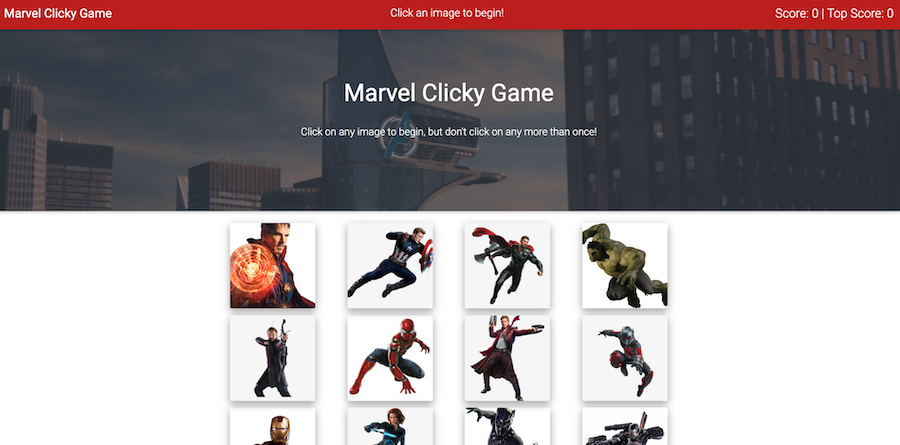

# Clicky-Game

An interactive memory game built with React. Click on any image to begin, but don't click on any more than once!

### Technologies Used

The following languages, Node packages, and frameworks were used to build this application:

- React
- JavaScript
- Node.js
- Create React App
- CSS
- MD Bootstrap framework

Visit the deployed app at: [Marvel Clicky Game](https://michelle-88.github.io/Clicky-Game/)

